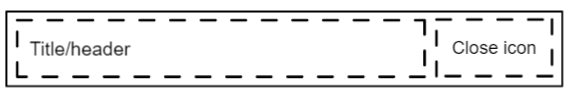
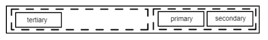
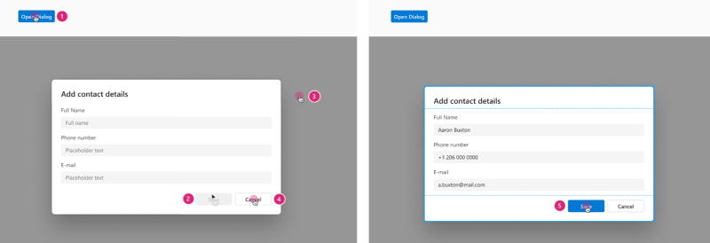
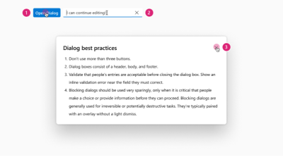
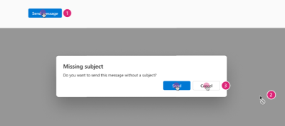
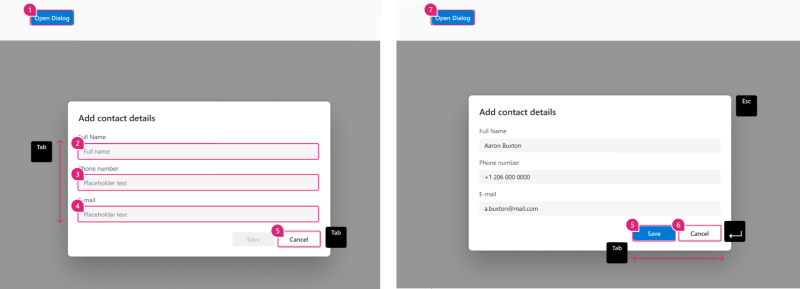
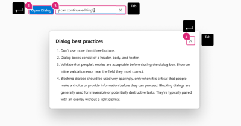
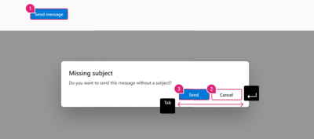

# @fluentui/react-dialog Spec

## Background

A dialog is a window overlaid on top of the page, and it is used to inform users of critical information, require a decision or to complete a task.

## Prior Art

- All mentions of v7 or v8 refer to Fabric - `@fluentui/react` ([docsite](https://developer.microsoft.com/en-us/fluentui#/))
- All mentions of v0 refer to Northstar - `@fluentui/react-northstar` ([docsite](https://fluentsite.z22.web.core.windows.net/))

- [Github epic](https://github.com/microsoft/fluentui/issues/20953)
- [Open UI Research](https://open-ui.org/components/dialog.research)
- Dialogs in 3rd party UI systems:
  - [Carbon](https://react.carbondesignsystem.com/?path=/docs/components-modal--default)
  - [Chakra UI](https://chakra-ui.com/docs/overlay/modal)
  - [FAST](https://explore.fast.design/components/fast-dialog)
  - [Material UI](https://mui.com/components/dialogs/)
  - [Radix](https://www.radix-ui.com/docs/primitives/components/dialog)
  - [Reach UI](https://reach.tech/dialog/)
  - [Reakit](https://reakit.io/docs/dialog/)
    - [Ariakit](https://github.com/reakit/reakit/tree/v2)
  - [Spectrum](https://react-spectrum.adobe.com/react-spectrum/Dialog.html)

### Comparison between v0 and v8

Note that the below code samples are not meant to be complete, but to highlight differences between the two libraries. Please refer to official docsites for actual API references.

#### v8

In v8 there are Dialog and Modal components which are relevant to the Dialog component for v9. The Dialog component was intended to be used primarily for confirming actions, whereas Modal component was intended to be used for lengthy content that may contain forms and other controls. This spec will only cover the comparison to the Dialog component.

The visibility of the dialog is controlled through the `hidden` prop whose its value should be a react state boolean provided from the consumer.

[Documentation for v8 Dialog](https://developer.microsoft.com/en-us/fluentui#/controls/web/dialog)

Sample code:

```jsx
  <DefaultButton secondaryText="Opens the Sample Dialog" onClick={toggleHideDialog} text="Open Dialog" />

  <Dialog
    hidden={hideDialog}
    onDismiss={toggleHideDialog}
    dialogContentProps={dialogContentProps}
    modalProps={modalProps}
  >
    <DialogFooter>
      <PrimaryButton onClick={toggleHideDialog} text="Send" />
      <DefaultButton onClick={toggleHideDialog} text="Don't send" />
    </DialogFooter>
  </Dialog>

```

#### v0

In v0, the Dialog component expects all the content through props, including the content, actions etc. The dialog component uses the `trigger` prop that expects a React component to control its visibility. The element passed to this prop will be rendered in-place where the dialog is defined.

[Documentation for v0 Dialog](https://fluentsite.z22.web.core.windows.net/components/dialog/definition)

```jsx
<Dialog
  cancelButton="Connect protocol"
  confirmButton="Transmit capacitor"
  content="Connect driver"
  header="Transmit capacitor"
  headerAction="Generate protocol"
  trigger={<Button content="A trigger" />}
/>
```

## API proposal

### Components

| Component    | Purpose                                                  |
| ------------ | -------------------------------------------------------- |
| Dialog       | The main wrapper component.                              |
| DialogHeader | (optional) Component for the title and the close button. |
| DialogBody   | (optional) Component for the main content of dialog.     |
| DialogFooter | (optional) Component for the main actions of dialog.     |

## Dialog

### Anatomy


### API

[Dialog.types.ts](https://github.com/microsoft/fluentui/blob/master/packages/react-dialog/src/components/Dialog/Dialog.types.ts)

| Property    | Values                        | Default   | Purpose                                    |
| ----------- | ----------------------------- | --------- | ------------------------------------------ |
| type        | `modal`, `non-modal`, `alert` | `modal`   | Dialog variations                          |
| isOpen      | boolean                       | `false`   | Set to `true` when the dialog is visible   |
| isDraggable | boolean                       | `false`   | Set to `true` to make the dialog draggable |
| overlay     | _slot_                        | undefined | Dimmed background of dialog                |

- `type` property (Dialog variations)

  - `modal`: When this type of dialog is open, the rest of the page is dimmed out and cannot be interacted with. The tab sequence is kept within the dialog and moving the focus outside the dialog will imply closing it. This is the default type of the component.

  - `non-modal`: When a non-modal dialog is open, the rest of the page is not dimmed out and users can interact with the rest of the page. This also implies that the tab focus can move outside the dialog when it reaches the last focusable element.

  - `alert`: are a special type of modal dialogs that interrupts the user's workflow to communicate an important message or ask for a decision. These dialogs are not dismissable, neither by escape key or by clicking outside the dialog.

### DOM

```html
<div role="dialog" class="fui-dialog">{children}</div>
```

## Dialog Header

### Anatomy


⚠️ Image subject to change!

### DOM

```html
<div class="fui-dialog-header">
  <span>{title}</span>
  <button aria-label="close" />
</div>
```

### API

| Property    | Values | Default   | Purpose       |
| ----------- | ------ | --------- | ------------- |
| header      | _slot_ | undefined | Dialog header |
| closeButton | _slot_ | undefined | Close button  |

## Dialog Footer

The footer is a container for the actions of the dialog, which must be not more than 3.


⚠️ Image subject to change!

```html
<div class="fui-dialog-footer">
  <button>{action1}</button>
  <button>{action2}</button>
  <button>{action3}</button>
</div>
```

⚠️ Should there be this grouping, actionButtons and the tertiary button?

⚠️ _Pending issue: should there be any handling for the order of buttons?_

## Dialog Body

The body is a container where the content of the dialog is rendered. Apart from padding, this component does not have other behaviour.

```html
<div class="fui-dialog-body">{children}</div>
```

## Sample Code

### Structure

TBA

### App

```tsx
<Button>Open Dialog</Button>

<Dialog>
  <DialogHeader>Missing Subject</DialogHeader>
  <DialogBody>Do you want to send this message without a subject?</DialogBody>
  <DialogFooter>
    <Button>Send</Button>
    <Button>Cancel<Button>
  </DialogFooter>
</Dialog>
```

### DOM structure

```html
<button>Open Dialog</button>
<!-- Something something something -->
<div class="fui-portal">
  <div class="fui-dialog">
    <div class="fui-dialog-overlay" />
    <header class="fui-dialog-header">Missing Subject</header>
    <div class="fui-dialog-body">Do you want to send this message without a subject?</div>
    <footer class="fui-dialog-footer">
      <button>Send</button>
      <button>Cancel<button>
    </footer>
  </div>
</div>
```

### useDialogInstance hook

Hook that provides the state management for a dialog.

## Migration

_TBA: Link to migration guide doc_

## Behaviours

### Mouse & touch

#### Modal



1. Clicking on the trigger (or interaction event that triggers the dialog) a Dialog is displayed with a dimmed background
2. Depending on the content, the dialog actions (footer) may be disabled until user completes tasks
3. Clicking on the dimmed background dismisses the dialog
4. Clicking the dismiss button (X icon in header), or one of the designated cancel/dismiss buttons (footer) will close the dialog
5. The dialog can be dismissed once the user confirms or completes the task using the confirmation button (footer)

#### Non-modal



1. Clicking on the trigger (or interaction event that triggers the dialog) a Dialog is displayed without a dimmed background
2. A user can continue to interact with elements on the page behind the dialog
3. Clicking the dismiss button (X icon in header), or one of the designated cancel/dismiss buttons (footer) can dismiss the dialog

#### Alert dialog



1. Clicking on the trigger (or interaction event that triggers the dialog) a Dialog is displayed with a dimmed background
2. A user cannot interact with elements outside of the dialog, clicking on the dimmed background will not close the dialog
3. Clicking the dismiss button (X icon in header), or the designated cancel/dismiss buttons (footer) can dismiss the dialog

### Keyboard

#### Modal



1. **(1)** TabKey to set focus on Trigger, use EnterKey to open.
2. **(2-5)** Focus (whose control depends upon the dialogs purpose) should be moved to the default focusable control inside the dialog. For dialogs that only provide a basic message, it could be an "OK" button. For dialogs containing a form it could be the first field in the form.
3. **(5-6)** After the dialog is dismissed, keyboard focus should be moved back to where it was before it moved into the dialog. Otherwise the focus can be dropped to the beginning of the page. Or if the item is no longer available it can be moved to the next logical location in that region i.e. next / previous item.
4. **TabKey** Moves focus to next focusable element inside the dialog. When focus is on the last focusable element in the dialog, moves focus to the first focusable element in the dialog.
5. **Shift+Tab** Moves focus to previous focusable element inside the dialog. When focus is on the first focusable element in the dialog, moves focus to the last focusable element in the dialog.
6. **EscKey** Closes the dialog.

#### Non-modal



1. **(1)** **TabKey** to set focus on Trigger, use EnterKey to open.
2. - **(2a)** Focus (whose control depends upon the dialogs purpose) should be moved to the default focusable control inside the dialog. For dialogs that only provide a basic message, it could be an "OK" button. For dialogs containing a form it could be the first field in the form.
   - **(2b)** **EnterKey** on dismiss action to close dialog, After the dialog is dismissed, keyboard focus should be moved back to where it was before it moved into the dialog. Otherwise the focus can be dropped to the beginning of the page.
3. **TabKey** Moves focus to next focusable element inside the dialog, once you get to the end of the focusable items within the dialog focus moves to next actionable items outside of the dialog container.
4. **Shift+Tab** Moves focus to previous focusable element inside the dialog and back to the trigger control.

#### Alert dialog



1. **(1)** **TabKey** to set focus on Trigger, use EnterKey to open.
2. **(2 & 3)** Focus is automatically set to the first focusable element inside the dialog, which is the "No" button. This is the least destructive action, so focusing "No" helps prevent users from accidentally confirming the destructive "Discard" action, which cannot be undone.
3. **EnterKey** Confirms or cancels the alert message and dialog is dismissed
4. **TabKey** Moves focus to next focusable element inside the dialog. When focus is on the last focusable element in the dialog, moves focus to the first focusable element in the dialog.
5. **Shift+Tab** Moves focus to previous focusable element inside the dialog. When focus is on the first focusable element in the dialog, moves focus to the last focusable element in the dialog.

## Accessibility

useful links:

- https://www.w3.org/TR/wai-aria-practices/examples/dialog-modal/dialog.html#

Follows the [Dialog WAI-Aria design pattern](https://www.w3.org/TR/wai-aria-practices-1.2/#dialog_modal)

ARIA attributes:

- `role` - `dialog`, `alertdialog`

Base accessibility information is included in the design document. After the spec is filled and review, outcomes from it need to be communicated to design and incorporated in the design document.

- Decide whether to use **native element** or folow **ARIA** and provide reasons
- Identify the **[ARIA](https://www.w3.org/TR/wai-aria-practices-1.2/) pattern** and, if the component is listed there, follow its specification as possible.
- Identify accessibility **variants**, the `role` ([ARIA roles](https://www.w3.org/TR/wai-aria-1.1/#role_definitions)) of the component, its `slots` and `aria-*` props.
- Describe the **keyboard navigation**: Tab Oder and Arrow Key Navigation. Describe any other keyboard **shortcuts** used
- Specify texts for **state change announcements** - [ARIA live regions
  ](https://developer.mozilla.org/en-US/docs/Web/Accessibility/ARIA/ARIA_Live_Regions) (number of available items in dropdown, error messages, confirmations, ...)
- Identify UI parts that appear on **hover or focus** and specify keyboard and screen reader interaction with them
- List cases when **focus** needs to be **trapped** in sections of the UI (for dialogs and popups or for hierarchical navigation)
- List cases when **focus** needs to be **moved programatically** (if parts of the UI are appearing/disappearing or other cases)
