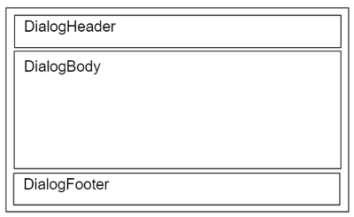

# @fluentui/react-dialog Spec

## Background

A dialog is a window overlaid on top of the page, and it is used to inform users of critical information, require a decision or to complete a task.

## Prior Art

- All mentions of v7 or v8 refer to Fabric - `@fluentui/react` ([docsite](https://developer.microsoft.com/en-us/fluentui#/))
- All mentions of v0 refer to Northstar - `@fluentui/react-northstar` ([docsite](https://fluentsite.z22.web.core.windows.net/))

- [Github epic](https://github.com/microsoft/fluentui/issues/20953)
- [Open UI Research](https://open-ui.org/components/dialog.research)
- Dialogs in 3rd party UI systems:
  - [Carbon](https://react.carbondesignsystem.com/?path=/docs/components-modal--default)
  - [Chakra UI](https://chakra-ui.com/docs/overlay/modal)
  - [FAST](https://explore.fast.design/components/fast-dialog)
  - [Material UI](https://mui.com/components/dialogs/)
  - [Radix](https://www.radix-ui.com/docs/primitives/components/dialog)
  - [Reach UI](https://reach.tech/dialog/)
  - [Reakit](https://reakit.io/docs/dialog/)
    - [Ariakit](https://github.com/reakit/reakit/tree/v2)
  - [Spectrum](https://react-spectrum.adobe.com/react-spectrum/Dialog.html)

### Comparison between v0 and v8

Note that the below code samples are not meant to be complete, but to highlight differences between the two libraries. Please refer to official docsites for actual API references.

#### v8

In v8 there are Dialog and Modal components which are relevant to the Dialog component for v9. The Dialog component was intended to be used primarily for confirming actions, whereas Modal component was intended to be used for lengthy content that may contain forms and other controls. This spec will only cover the comparison to the Dialog component.

The visibility of the dialog is controlled through the `hidden` prop whose its value should be a react state boolean provided from the consumer.

[Documentation for v8 Dialog](https://developer.microsoft.com/en-us/fluentui#/controls/web/dialog)

Sample code:

```jsx
  <DefaultButton secondaryText="Opens the Sample Dialog" onClick={toggleHideDialog} text="Open Dialog" />

  <Dialog
    hidden={hideDialog}
    onDismiss={toggleHideDialog}
    dialogContentProps={dialogContentProps}
    modalProps={modalProps}
  >
    <DialogFooter>
      <PrimaryButton onClick={toggleHideDialog} text="Send" />
      <DefaultButton onClick={toggleHideDialog} text="Don't send" />
    </DialogFooter>
  </Dialog>

```

#### v0

In v0, the Dialog component expects all the content through props, including the content, actions etc. The dialog component uses the `trigger` prop that expects a React component to control its visibility. The element passed to this prop will be rendered in-place where the dialog is defined.

[Documentation for v0 Dialog](https://fluentsite.z22.web.core.windows.net/components/dialog/definition)

```jsx
<Dialog
  cancelButton="Connect protocol"
  confirmButton="Transmit capacitor"
  content="Connect driver"
  header="Transmit capacitor"
  headerAction="Generate protocol"
  trigger={<Button content="A trigger" />}
/>
```

## API proposal

### Components

| Component    | Purpose                                                  |
| ------------ | -------------------------------------------------------- |
| Dialog       | The main wrapper component.                              |
| DialogHeader | (optional) Component for the title and the close button. |
| DialogBody   | (optional) Component for the main content of dialog.     |
| DialogFooter | (optional) Component for the main actions of dialog.     |

## Dialog

### Anatomy



### API

[Dialog.types.ts](https://github.com/microsoft/fluentui/blob/master/packages/react-dialog/src/components/Dialog/Dialog.types.ts)

| Property       | Values                        | Default | Purpose                                  |
| -------------- | ----------------------------- | ------- | ---------------------------------------- |
| type           | `modal`, `non-modal`, `alert` | `modal` | Dialog variations                        |
| isOpen         | boolean                       | `false` | Set to `true` when the dialog is visible |
| overlay (slot) | -                             | -       | Dimmed background of dialog              |

## Dialog Header

- title and close button (Decision needed: close button a slot or a component?)

## Dialog Footer

- Button (primary, secondary, tertiary) order, an issue to be resolved from design.

## Dialog variations - `type` property

- Modal dialog

  When this type of dialog is open, the rest of the page is dimmed out and cannot be interacted with. The tab sequence is kept within the dialog and moving the focus outside the dialog will imply closing it. This is the default type of the component.

  `role="dialog"`

- Non-modal dialog

  When a non-modal dialog is open, the rest of the page is not dimmed out and users can interact with the rest of the page. This also implies that the tab focus can move outside the dialog when it reaches the last focusable element.

  `role="dialog"`

- Alert dialog

  Alert dialog are a special type of modal dialogs that interrupts the user's workflow to communicate an important message or ask for a decision. These dialogs are not dismissable, neither by escape key or by clicking outside the dialog.

  `role="alertdialog"`

### Sample Code

### Structure

TBA

#### App

```tsx
<Button>Open Dialog</Button>

<Dialog>
  <DialogHeader>Missing Subject</DialogHeader>
  <DialogBody>Do you want to send this message without a subject?</DialogBody>
  <DialogFooter>
    <Button>Send</Button>
    <Button>Cancel<Button>
  </DialogFooter>
</Dialog>
```

#### DOM structure

```html
<button>Open Dialog</button>
<!-- Something something something -->
<div class="fui-portal">
  <div class="fui-dialog">
    <div class="fui-dialog-overlay" />
    <header class="fui-dialog-header">Missing Subject</header>
    <div class="fui-dialog-body">Do you want to send this message without a subject?</div>
    <footer class="fui-dialog-footer">
      <button>Send</button>
      <button>Cancel<button>
    </footer>
  </div>
</div>
```

#### useDialogInstance hook

Hook that provides the state management for a dialog.

## Migration

_Describe what will need to be done to upgrade from the existing implementations:_

- _Migration from v8_
- _Migration from v0_

## Behaviors

TODO:

- add the modeless dialog behavior
- add the alert dialog behavior
- 400% zoom behaviour

  _Explain how the component will behave in use, including:_

- _Component States_
- _Interaction_
  - _Keyboard_
  - _Cursor_
  - _Touch_
  - _Screen readers_

## Accessibility

useful links:

- https://www.w3.org/TR/wai-aria-practices/examples/dialog-modal/dialog.html#

Follows the [Dialog WAI-Aria design pattern](https://www.w3.org/TR/wai-aria-practices-1.2/#dialog_modal)

Once the dialog is open, the focus will be trapped within the dialog and the user can either click the overlay to close the dialog or press the escape key to close the dialog. When closed, the focus will be restored to the element that opened the dialog.

Keyboard interaction:

- `Enter`, `Space` - Open/Close the dialog
- `Tab` - Move focus to first tabbable element in the dialog
- `Shift + Tab` - Move focus to the previous focusable element in the dialog
- `Escape` - Closes dialog and focus moves back to the element that opened the dialog

ARIA attributes:

- `role` - `dialog`, `alertdialog`

Base accessibility information is included in the design document. After the spec is filled and review, outcomes from it need to be communicated to design and incorporated in the design document.

- Decide whether to use **native element** or folow **ARIA** and provide reasons
- Identify the **[ARIA](https://www.w3.org/TR/wai-aria-practices-1.2/) pattern** and, if the component is listed there, follow its specification as possible.
- Identify accessibility **variants**, the `role` ([ARIA roles](https://www.w3.org/TR/wai-aria-1.1/#role_definitions)) of the component, its `slots` and `aria-*` props.
- Describe the **keyboard navigation**: Tab Oder and Arrow Key Navigation. Describe any other keyboard **shortcuts** used
- Specify texts for **state change announcements** - [ARIA live regions
  ](https://developer.mozilla.org/en-US/docs/Web/Accessibility/ARIA/ARIA_Live_Regions) (number of available items in dropdown, error messages, confirmations, ...)
- Identify UI parts that appear on **hover or focus** and specify keyboard and screen reader interaction with them
- List cases when **focus** needs to be **trapped** in sections of the UI (for dialogs and popups or for hierarchical navigation)
- List cases when **focus** needs to be **moved programatically** (if parts of the UI are appearing/disappearing or other cases)
